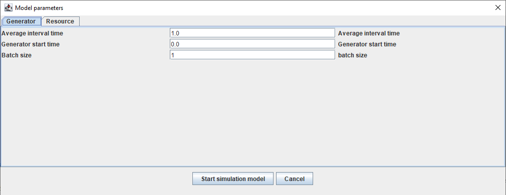
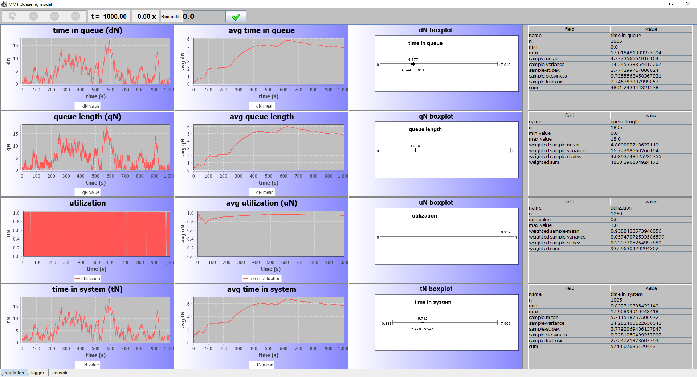

# Example DSOL Queuing model using discrete events

This is the first example of building a complete model for an M/M/1 queuing system using event scheduling. The next topic shows the same model using the flow library of DSOL.

## Introduction
An M/M/1 queuing system is a system with one server (that's what the 1 stands for in M/M/1), and parts or clients arriving at the server with an exponentially distributed inter-arrival time (the first M denotes that) and an exponentially distributed service time (the second M denotes that). 
For an M/M/1 system to be stable, the average service rate (number of items that can be served per time unit), denoted as $\mu$ should be less than the average number of arrivals per time unit, denoted as $\lambda$. The ratio between $\lambda$ and $\mu$ is called $\rho = \lambda / \mu$, and it is also known as the average utilization of the queuing system. When $\rho$ is less than one, the system is stable, since fewer items arrive than the number that can be served. Sometimes, $\mu$ denotes the service time distribution, and $\lambda$ the inter-arrival time distribution; in that case the average inter-arrival time should of course be larger than the average service time for the system to be stable. 

For a typical queuing system, we are interested in simulating different arrival rates with different service times, and studying the following main output variables:

- queue length (development over time, average, standard deviation, min, max)
- time in queue (development over time, average, standard deviation, min, max)
- time in system (development over time, average, standard deviation, min, max)
- utilization of the server (development over time, average)

If we build a simulation model using event scheduling for this, we need the following types of components:

1. **An entity** that flows through the model
2. **An arrival generator** that creates entities with an interarrival time drawn from the correct distribution
3. **A server** that can serve entities for a given time
4. **A queue** in which waiting entities can be stored
5. **Output statistics objects** to gather the required statistics
6. **Experiment management** including the replication settings and seed management
7. **Random distributions** to draw the inter-arrival time and service times
8. **Input parameters** for the model to set the experimental conditions
9. **A program** that can be started and that creates the simulator, model, and makes it work.
10. **A GUI** to display statistics and graphs to the user


## Implementation using event scheduling
Event scheduling is also called 'delayed method invocation'. This means that we can call any method in the model, delayed by a specified duration on an artificial timeline, maintained by the simulation clock. The simulator will take care that all these method calls (also known as **'events'**, are carried out in the right sequence and with the correct simulator time being available. Nothing happens between events, so the simulator jumps from event to event, updating the simulator clock at every event. When multiple events happen at the same time, they can be prioritized; if they have the same priority, they will be handled in a first-come-first-serve manner.

Let's now conceptually discuss each of the three components above:


### 1. An entity that flows through the system
Suppose we have a class called `Entity` that we want to generate. The `Entity` has a `createTime` and an `id`. The `createTime` is useful to calculate the time in system. When we subtract the `entity.createTime` from the simulator time at the moment when the entity leaves the system, we can tally the time in system of that entity for the statistics. 

The simple implementation for such an entity would be:

```java
  public class Entity
  {
    private final double createTime;
    private final int id;

    public Entity(final int id, final double createTime)
    {
      this.id = id;
      this.createTime = createTime;
    }

    public double getCreateTime() 
    {
      return this.createTime;
    }

    public int getId()
    {
      return this.id;
    }

    @Override
    public String toString()
    {
      return "Entity [createTime=" + this.createTime + ", id=" + this.id + "]";
    }
  }
```


### 2. An arrival generator that makes entities
For the generation of the entities, we create a method called `generate()`, that we call when constructing the model. The `generate` method creates one entity and either offers it to the `startProcess(Entity)` method when the server is idle, or adds it to the rear of the queue when the server is busy. 

After the just created entity has been handled, the `generate()` method calls itself after a time equal to a random value drawn from the Exponential inter-arrival time distribution. In a sense, the method re-schedules itself indefinitely, each time with an inter-arrival time from a given exponential distribution with $\lambda$ as the parameter.

The most basic code to generate an entity would be:

```java
  protected void generate()
  {
    double time = this.simulator.getSimulatorTime();
    Entity entity = new Entity(this.entityCounter++, time);
    if (this.capacity - this.busy >= 1)
    {
      // process
      startProcess(entity);
    }
    else
    {
      // queue
      this.queue.add(entity);
    }
    this.simulator.scheduleEventRel(this.interArrivalTime.draw(), 
        this, "generate", null);
  }
```

A few explanations:

- The `Model` class has a queue called `queue`, which is for now a `List<Entity>`, a server capacity called `capacity` (default 1), and a number of entities being processed by the server at this moment called `busy` (0 or 1 in the default situation).
- The method `simulator.getSimulatorTime()` returns the current time of the simulator.
- The last line re-schedules the `generate()` method. It indicates that we should schedule after a relative duration (`scheduleEventRel`) and not at an absolute point in time. The interarrival time is drawn from a distribution object (see #6) called `interArrivalTime`. The last three arguments indicate the object instance on which the method will eventually be scheduled (`this`), the name of the method (`generate`) and the arguments to pass to the method (`null`), so no arguments.

!!! Note
    The time stays constant as long as the executed event (method) is busy. If the execution of a method takes 5 minutes on the wall clock (real time), the simulation clock is standing still for that entire duration. On the other hand, if the next event is 1000 years later than the last event, the simulator clock will instantaneously jump 1000 years ahead to execute the next event.

!!! Note
    The execution of the methods is single-threaded. No parallel execution occurs, and the `Simulator` carries out one event at a time, so we do not have to be afraid that another entity is being generated while we did not yet increase the `busy` flag of the server. The next event will only be carried out when the current event, including method calls to other methods, has been completed. 


### 3. A server that can serve the entities for a given time
When the server is free, it is offered a generated entity at some time through the `startProcess(entity)` method. To indicate that the server is busy, we increase the value of the variable `busy` by 1 (this is already a preparation for the so-called M/M/c system where multiple entities can be served at the same time). 

#### startProcess()
The `startProcess(entity)` method of the server calculates some statistics, and releases the entity after the service time by calling the `endProcess(entity)` method. The `startProcess(..)` method looks as follows:

```java
  protected void startProcess(final Entity entity)
  {
    this.busy++;
    this.simulator.scheduleEventRel(this.processingTime.draw(), 
        this, "endProcess", new Object[] {entity});
  }
```

The first statement increases the number of entities that are being processed.The second statement is scheduling the end of the process; it draws a delay from the `processingTime` distribution, and schedules a call to the method named `this.endProcess` after the delay. The methods expects one argument: the `entity`. In a sense, it is calling the method `this.endProcess(entity)` after the delay. 

#### endProcess()
The `endProcess(entity)` method has to do two things: (1) increasing the available capacity of the server, (2) seeing if there are entities waiting in the queue and if yes, removing the first entity from the queue and processing it on the server. The method looks as follows:

```java
    protected void endProcess(final Entity entity)
    {
        this.busy--;
        if (!this.queue.isEmpty())
        {
            Entity nextEntity = this.queue.remove(0);
            startProcess(nextEntity);
        }
    }
```

The first statement is analogous to that in the `startProcess()` method, but instead of decreasing the used capacity, it increases the used capacity by one. Statement 2 checks whether there are elements in the queue. If yes, we remove the first entry from the queue, and offer it to the `startProcess` method. Since no statement using the entity comes afterward, the entity is removed from the model after processing.


### 4. A queue in which waiting entities can be stored
In this model, the queue is represented by a java `List`. As was shown in the previous step, it would be sufficient to store the entity in the list with `this.queue.add(entity)`, and remove the first entity from the queue with `Entity entity = this.queue.remove(0)`. When the model gets more complicated, however, and multiple servers with queues are part of the model, the queue should store the time when the entity entered the queue together with the entity itself. This is exactly what we do in step 4 for this model:

```java
  protected class QueueEntry<E>
  {
    private final double queueInTime;
    private final E entity;

    public QueueEntry(final E entity, final double queueInTime)
    {
        this.entity = entity;
        this.queueInTime = queueInTime;
    }

    public double getQueueInTime()
    {
        return this.queueInTime;
    }

    public E getEntity()
    {
        return this.entity;
    }

    @Override
    public String toString()
    {
        return "QueueEntry [queueInTime=" + this.queueInTime 
            + ", entity=" + this.entity + "]";
    }
  }
```

!!! Note
    Note that the `QueueEntry` class can store any type of object, not just an object of type `Entity`. So, it could store persons, parts, or requests, represented by other object classes, as well.


The `QueueEntry` stores the entity AND the time when it entered the queue. Thereby, it is easy to determine the duration that the entity spent in the queue when it leaves the queue. The queue is now defined as follows in the model:

```java
  private List<QueueEntry<Entity>> queue = new ArrayList<>();
```

The `generate` method stores an entity with the current time in the queue when the server is busy:

```java
  protected void generate()
  {
    double time = this.simulator.getSimulatorTime();
    Entity entity = new Entity(this.entityCounter++, time);
    if (this.capacity - this.busy >= 1)
    {
      // process
      startProcess(entity);
    }
    else
    {
      // queue
      this.queue.add(new QueueEntry<Entity>(entity, time));
    }
    this.simulator.scheduleEventRel(this.interArrivalTime.draw(), 
        this, "generate", null);
  }
```

The `endProcess()` method therefore retrieves a `QueueEntry` object from the queue instead of a bare `Entity`:

```java
    protected void endProcess(final Entity entity)
    {
        this.busy--;
        if (!this.queue.isEmpty())
        {
            QueueEntry<Entity> nextQueueEntry = this.queue.remove(0);
            startProcess(nextQueueEntry.getEntity());
        }
    }
```


### 5. Output statistics to store the results
The model defines four output statistics:

```java
  SimTally<Double> tallyTimeInQueue;
  SimTally<Double> tallyTimeInSystem;
  SimPersistent<Double> persistentUtilization;
  SimPersistent<Double> persistentQueueLength;
```

Two of the statistics are tallies, and two of the statistics are persistent, or time weighted, statistics. 

A tally is a statistic for which you register values, and it calculates mean, standard deviation, min, max, and higher order moments by simply using the observations as such. The mean is calculated by:

$$
  \text{mean} = \sum_{i=1}^N{\frac{v_i}{N}}
$$

where $v_i$ are the registered values, and $N$ is the number of registered values. If we register the values 2 and 4, the average is 3.

A persistent statistic is a time-weighted statistic that takes into account how long a certain value persisted. If we offer the value 2 for 10 time units, and the value 4 for 2 time units, the average is (10 * 2 + 2 * 4) / 12 = 2.33. Instead of dividing by the number of observations, we divide over the total time. The mean is calculated by:

$$
  \text{mean} = \int_0^T{\frac{t_i * v_i}{T}}\text{ where }T = \sum_{i=1}^N{t_i}
$$

In this case, $N$ is the number of registered values, $v_i$ are the registered values, and $t_i$ are the durations for which value $v_i$ was registered.

Therefore, a tally only needs a value to be registered:

```java
  this.tallyTimeInQueue.register(time - queueEntry.getQueueInTime());
```

whereas a persistent statistic needs a timestamp AND a new value to be registered:

```java
  this.persistentQueueLength.register(time, this.queue.size());
```

The `tallyTimeInQueue` keeps the statistics for the time the entities spent in the queue. Every time an entity leaves the queue, the statistic is updated. The `tallyTimeInQueue` statistic registers the value for the time-in-queue statistic, by subtracting the time the entity entered the queue (`queueEntry.getQueueInTime()`) from the current simulation time. This is the time that the entity has spent in the queue. When there is **no** waiting time in the queue, we have to explicitly register this as a zero waiting time.

The `persistentQueueLength` keeps the statistics for the queue length. Every time an entity enters the queue or leaves the queue, the statistic is updated. 


In the `generate` process, we have to update the tally and the persistent statistic:

```java
  protected void generate()
  {
    double time = this.simulator.getSimulatorTime();
    Entity entity = new Entity(this.entityCounter++, time);
    if (this.capacity - this.busy >= 1)
    {
      // process
      this.tallyTimeInQueue.register(0.0); // no waiting
      startProcess(entity);
    }
    else
    {
      // queue
      this.queue.add(new QueueEntry<Entity>(entity, time));
      this.persistentQueueLength.register(time, this.queue.size());
    }
    this.simulator.scheduleEventRel(this.interarrivalTime.draw(), 
        this, "generate", null);
  }
```

In the `startProcess` method, we have to explicitly update the utilization of the server:

```java
  protected void startProcess(final Entity entity)
  {
    double time = getSimulator().getSimulatorTime();
    this.busy++;
    this.persistentUtilization.register(time, this.busy);
    this.simulator.scheduleEventRel(this.processingTime.draw(), 
        this, "endProcess", new Object[] {entity});
```
 
In the `endProcess` method, we update all four statistics:
 
```java
  protected void endProcess(final Entity entity)
  {
    double time = getSimulator().getSimulatorTime();
    this.busy--;
    this.persistentUtilization.register(time, this.busy);
    if (!this.queue.isEmpty())
    {
        QueueEntry<Entity> nextQueueEntry = this.queue.remove(0); 
        this.persistentQueueLength.register(time, this.queue.size());
        this.tallyTimeInQueue.register(time - nextQueueEntry.getQueueInTime());
        startProcess(nextQueueEntry.getEntity());
    }
    this.tallyTimeInSystem.register(time - entity.getCreateTime());
  }
```

Four statistics are updated:
- The utilization of the server goes down. Therefore, the `persistentUtilization` statistic is updated.
- An entity leaves the system. Therefore, the `tallyTimeInSystem` statistic is updated with the time the entity spent in the system (`time - entity.getCreateTime()`).
- When an entity is removed from the queue, the queue length decreases. Therefore, the `persistentQueueLength` statistic is updated.
- When an entity is removed from the queue, the `tallyTimeInQueue` statistic is updated, by registering the time the entity spent in the queue.


In order for the simulation statistics to work, the `Model` class now has to become a `DsolModel`. This prepares for proper initialization of the models when we do multiple replications, for random number generator seed management in case of multiple replications, for the provision of imput parameters, and for automatic storage of results.

The class definition therefore becomes:

```java
class DesQueueingModel5 extends AbstractDsolModel<Double, DevsSimulatorInterface<Double>>
```

The generics of the class say that we use a `Double` to store the time, and that we use a `DevsSimulator` to simulate the model.

When we use a `DsolModel`, a `constructModel` method needs to be implemented. This is the method that is called at every run or replication to construct the model and initialize the statistics. 

The constructor of `DesQueueingModel5` looks as follows:

```java
  public DesQueueingModel5(final DevsSimulatorInterface<Double> simulator, 
    final DistContinuous interArrivalTime, final DistContinuous processingTime)
  {
    super(simulator);
    this.interArrivalTime = interArrivalTime;
    this.processingTime = processingTime;
  }
```

The `constructModel` method looks as follows:

```java
  @Override
  public void constructModel() throws SimRuntimeException
  {
    this.tallyTimeInQueue = new SimTally<>("Time in queue", this);
    this.tallyTimeInSystem = new SimTally<>("Time in system", this);
    this.persistentQueueLength = new SimPersistent<>("Queue length", this);
    this.persistentUtilization = new SimPersistent<>("Server utilization", this);

    this.simulator.scheduleEventRel(this.interArrivalTime.draw(), this, "generate", null);
  }
```

It creates the four statistics, and schedules for the `generate` method to instantiate the first entity after a stochastic `interarrivalTime`. When the model is started, this will be the first event to be carried out. 

!!! Warning
    Note that we do not explicitly **call** the `generate` method, since this would mean that we already execute simulation code during the construction of a model, before the entire model has been properly initialized, and before we explicitly started an experiment. Therefore, it is good practice to always defer the execution of model code with a `ScheduleEvent` method in `constructModel`.


### 6. Experiment management
A simulation model is executed as part of a properly designed experiment. The experiment sets the input parameters, measures the output statistics, and establishes a relationship between the input parameters and the calculated indicators. Often, the model is ran multiple times (so-called *replications* of the simulation run), to avoid any dependency on the particularities of a specific run. When the model is stable, and the indicators easily converge towards the same value, a handful of replications, typically 5 or 10, is sufficient. When the model has rare events that can happen at particular times, such as weather events, failures, or disturbances, many more replications are needed to assess the true value of the output statistics, since the outcome of two replications can differ significantly. In such a case, the 95% confidence interval of the output statistics needs to be calculated and replications have to be repeated until the confidence interval is considered to be small enough for the purpose of the experiment. In this case, we start with observing one replication, but want to extend to multiple replications later.

Two other values that need to be set for the experiment are the length of each run, and the so-called warmup period -- the start period of the model that it needs to cover the transient period. When a model needs time to get realistically 'filled' and therefore show realistic behavior, we remove the first part of the run (that shows unrealistic behavior, e.g., because the model is too 'empty') from the statistics. In other words, the warmup period is the duration after which the statistics are all reset to their initial values. For this queueing model, we set the run time to 1000 time units, and the warmup period to 0, since an empty system is quite realistic, and the system is so simple, it does not need any time to get realistically filled.

In the code, setting up the `Simulator`, `Model` and `Replication` is pretty straightforward:

```java
  DesQueueingApplication6()
  {
    var simulator = new DevsSimulator<Double>("MM1.Simulator");
    var stream = new MersenneTwister(1);
    var interArrivalTime = new DistExponential(stream, 1.0);
    var processingTime = new DistExponential(stream, 0.9);
    var model = new DesQueueingModel6(simulator, interArrivalTime, processingTime);
    var replication = new SingleReplication<>("rep1", 0.0, 0.0, 1000.0);
    simulator.initialize(model, replication);
    simulator.start();
  }

  public static void main(final String[] args)
  {
    new DesQueueingApplication6();
  }
```

Explanation:

- We first create a `DevsSimulator`. The time type for the Simulator is `Double` (it could also be, e.g., `Float`, `Integer`, or `Duration`). The Simulator has a name to identify it: "MM1.Simulator". `DevsSimulator` stands for a Discrete Event Simulator -- a simulator that maintains an event list with future events, and that allows for delayed method invocation. Several other types of simulators exist within DSOL.
- We create a random stream and the distribution functions for the inter-arrival time and processing time (see section 7 how to do this in a better way).
- The `DesQueueingModel6` is created, using the simulator and the two distribution functions.
- The `Replication` is instantiated next as a `SingleReplication` (so this is not an experiment with multiple replications) with name "rep1", starting time 0.0, warmup period 0.0, and run length 1000 time units. 
- The simulator initializes the model with data from the replication (timing, seeds, random streams, input variables). 
- The simulator is asked to start the model execution.

!!! Note
    When the simulator receives the `initialize` method call, it first *constructs* the model by calling the `model.constructModel()` method. In other words, the model carries out all the initial code that is necessary to start executing. Sometimes this is only a few statements of code. In other cases, the entire model is instantiated from a database. The reason for carrying out the initialization is (a) that thereby the values of input variables can be used to create the structure of the model, and (b) the model is initialized for every replication to its initial state, and there are no 'leftovers' from previous replications.
    
When we would want to carry out 10 replications, the construction of the simulator, model, and experiment would look as follows:

```java
  DesQueueingApplication6()
  {
    var simulator = new DevsSimulator<Double>("MM1.Simulator");
    var stream = new MersenneTwister(12);
    var interArrivalTime = new DistExponential(stream, 1.0);
    var processingTime = new DistExponential(stream, 0.9);
    var model = new DesQueueingModel6(simulator, interArrivalTime, processingTime);
    var experiment = new Experiment<>("mm1", this.simulator, 
        this.model, 0.0, 0.0, 1000.0, 10);
    experiment.start();
  }
```

In this case, the creation of the simulator and the model is the same, but now we create an `Experiment` that has the same arguments as the `SingleReplication` class above, but with one extra argument: the number of replications (10). When starting the experiment, it will create the replications one-by-one, initialize the model with the replication, and start the replication. Summary statistics are gathered that can be used after all 10 replications have been completed.

With a few `println` statements in the single-replication case, we can see that the application works properly and executes a simulation:

```
Time: 0.123. Generated entity 0
Time: 0.495. Generated entity 1
Time: 0.495. Entity 1 entered the queue. Length: 1
Time: 0.569. Generated entity 2
Time: 0.569. Entity 2 entered the queue. Length: 2
Time: 0.734. Entity 0 left the system. Time in system: 0.610
Time: 0.818. Generated entity 3
Time: 0.818. Entity 3 entered the queue. Length: 2
Time: 1.012. Generated entity 4
Time: 1.012. Entity 4 entered the queue. Length: 3
Time: 1.245. Entity 1 left the system. Time in system: 0.749
Time: 1.248. Generated entity 5
Time: 1.248. Entity 5 entered the queue. Length: 3
Time: 1.349. Entity 2 left the system. Time in system: 0.780
Time: 1.788. Entity 3 left the system. Time in system: 0.970
Time: 2.225. Entity 4 left the system. Time in system: 1.213
Time: 2.517. Generated entity 6
```


### 7. Random distributions to draw the inter-arrival time and service times
DSOL has a solid system for random number generation (RNG), stochastic distributions, and seed management. 

#### Random number generator
DSOL allows for multiple, independent, random streams to be used in the model, allowing for the usage of so-called *Common Random Numbers* experiments. The most used random number generator is the *Mersenne Twister*, the de facto standard for RNG in discrete-event simulation. Other RNGs are offered as well, and it is easy to add a special RNG if needed. Random streams are typically offered through DSOL's experiment management, but can also be created by hand:

```java
  private StreamInterface stream = new MersenneTwister(12);
```

where 12 is the (fixed) seed of the RNG. The disadvantage of defining your own RNG is that the seed is not changed between replications, in case the model is ran multiple times to get a confidence interval for the output statistics such as the average time-in-queue or the average utilization of the server. Experiment management (see section 6) takes care of defining random streams that *are* (reproducibly) changed between replications.

!!! Note
    Proper experimentation with simulation models is all about reproducibility. So, we want some values to be random, but it should be reproducibly random. This means that if we run the model again, with the same seed settings, we should get exactly the same results. Only when these conditions are fulfilled, we can use the simulation to run a proper scientific experiment. Seed management for the RNGs is key in ensuring randomness *and* reproducibility.

#### Stochastic distributions
A model can define multiple stochastic distributions, by specifying the type of distribution, the parameters for the distribution, and the RNG to be used for drawing the random numbers. DSOL offers both continuous distributions such as Exponential, Triangular, Normal, Uniform, Weibull, Gamma, Beta, Lognormal, and discrete distributions such as Poisson, Discrete Uniform, Bernoulli, and Geometric. A distribution is a class that is instantiated, e.g., as follows for the inter-arrival distribution and the service time distribution:

```java
  private DistContinuous interArrivalTime = new DistExponential(stream, 1.0);
  private DistContinuous processingTime = new DistExponential(stream, 0.9);
```

Drawing a value from such a distribution is done by, e.g., `this.interArrivalTime.draw()`. 


#### Seed management
The `SingleRreplication` example for the RNG is not using seed management, and has the same value for the seed for all replications. That is clearly not what we would want for an experiment with multiple replications. For this use case, the `Experiment` class in DSOL takes care of proper seed management, updating the seed value for each new replication in a reproducible way. You can create as many properly managed random streams in the experiment as needed, but there is always one default stream available in the `Experiment` that you can use. You can access it by:

```java
  StreamInterface defaultStream = getDefaultStream();
```

This stream can now be used in the stochastic distributions for the inter-arrival time and the service time:

```java
  this.interArrivalTime = new DistExponential(defaultStream, 1.0);
  this.processingTime = new DistExponential(defaultStream, 0.9);
```

The streams will automatically be reset with a new seed before a new replication starts. 

The above insights have been used in the application `DesQueueingApplication7` and the model `DesQueueingModel7`. The constructor of the application now looks as follows:

```java
  DesQueueingApplication7()
  {
    var simulator = new DevsSimulator<Double>("MM1.Simulator");
    double lambda = 1.0;
    double mu = 0.9;
    var model = new DesQueueingModel7(simulator, lambda, mu);
    var replication = new SingleReplication<>("rep1", 0.0, 0.0, 1000.0);
    simulator.initialize(model, replication);
    simulator.start();
  }
```

Instead of the distributions, their parameters `lambda` and `mu` are provided to the model. Thereby, the model can initialize the random generators based on seed management in the `constructModel()` method of the model for each experiment or replication:

```java
  public DesQueueingModel7(final DevsSimulatorInterface<Double> simulator, 
      final double lambda, final double mu)
  {
    super(simulator);
    this.lambda = lambda;
    this.mu = mu;
  }

  @Override
  public void constructModel() throws SimRuntimeException
  {
    this.interArrivalTime = new DistExponential(getDefaultStream(), this.lambda);
    this.processingTime = new DistExponential(getDefaultStream(), this.mu);
    
    this.tallyTimeInQueue = new SimTally<>("Time in queue", this);
    this.tallyTimeInSystem = new SimTally<>("Time in system", this);
    this.persistentQueueLength = new SimPersistent<>("Queue length", this);
    this.persistentUtilization = new SimPersistent<>("Server utilization", this);

    this.simulator.scheduleEventRel(this.interArrivalTime.draw(), this, "generate", null);
  }
```

By using the `DefaultStream`, an implicit connection to seed management and properly initializing the random number generators at each replication is guaranteed.


### 8. Input parameters for the model to set the experimental conditions
In most cases, an experiment with a simulation model has input values that can be changed, to establish the relationship between the input values on the output statistics. DSOL provides a wide range of input values that can be set and accessed in the model. The input parameters are stored in a hierarchical map, that enables parameters that belong together to be grouped. Many types of parameters exist, such as strings, floating point variables, integers, units, scalar quantities with a unit, values from a list, continuous distributions, discrete distributions, and submaps. 

In the case of the M/M/1 model, we would want to set the parameter values for the exponential distributions for the inter-arrival times and for the service times. We also could set the capacity for the server. In code, this would look as follows:

```java
  this.inputParameterMap.add.add(new InputParameterDouble("intervalTime", 
      "Average interval time", "Average interval time", 1.0, 1.0));
  this.inputParameterMap.add(new InputParameterDouble("serviceTime", 
      "Average service time", "Average service time", 0.8, 2.0));
  this.inputParameterMap.add(new InputParameterDouble("capacity", 
      "Server capacity", "Server capacity", 1.0, 3.0));
```

Suppose we would also like to set the batch size of arrivals, as well as the start time of the generation process. Since we have a number of parameters for the generator and a number of parameters or the server, we could separate these in two sub-maps. 

```java
  InputParameterMap generatorMap = new InputParameterMap("generator", 
      "Generator", "Generator", 1.0);
  generatorMap.add(new InputParameterDouble("intervalTime", 
      "Average interval time", "Average interval time", 1.0, 1.0));
  generatorMap.add(new InputParameterDouble("startTime", 
      "Generator start time", "Generator start time", 0.0, 2.0));
  generatorMap.add(new InputParameterInteger("batchSize", 
      "Batch size", "batch size", 1, 3.0));
  this.inputParameterMap.add(generatorMap);
  InputParameterMap resourceMap = new InputParameterMap("resource", 
      "Resource", "Resource", 2.0);
  resourceMap.add(new InputParameterInteger("capacity", 
      "Resource capacity", "Resource capacity", 1, 1.0));
  resourceMap.add(new InputParameterDouble("serviceTime", 
      "Average service time", "Average service time", 0.9, 2.0));
  this.inputParameterMap.add(resourceMap);
```

The arguments of the methods are as follows:

1. key, by which the value can be easily retrieved.
2. short name to display the value, e.g., in a table
3. longer description to explain the input value in, e.g., a GUI. This string may contain HTML markup.
4. default value.
5. sequence number in this map as a floating point value, making it easy to insert a value without renumbering. If another value would have to be added between the intervalTime and serviceTime, it could get 1.5 as its sequence, which would place it between the first two values for the user interface or display. The sequence number is always the last number in the constructor call of an `InputParameter`.

To retrieve a set input value and either set it to a field, or use it to define a distibution, the model can use, e.g., the following code:

```java
  this.capacity = (Integer) getInputParameter("resource.capacity");
  this.batchSize = (Integer) getInputParameter("generator.batchSize");
  double startTime = (Double) getInputParameter("generator.startTime");
  double iat = (Double) getInputParameter("generator.intervalTime");
  this.interarrivalTime = new DistExponential(getDefaultStream(), iat);
  double st = (Double) getInputParameter("resource.serviceTime");
  this.processingTime = new DistExponential(getDefaultStream(), st);
  getSimulator().scheduleEventRel(startTime, this, "generate", null);
```

The call to `getInputParameter(key)` returns the set *value* for the input parameter that has to be cast to the right type. It is also possible to retrieve the parameter *object* with a call to `this.inputParameterMap.get(key)`. This parameter *object* has `getKey()`, `getDescription()`, `getDefaultValue()` and `getValue()` methods, and several more. Here, we could use the `getValue()` method to retrieve the value set by the user, and cast it to a Double. Typically, however, we just use the `getInputParameter(key)` method since it is the most straightforward, and we don't need the other methods of the `InputParameter` object.

The model `DesQueueingModel8` how the `InputParameterMap` can be defined and used.

!!! Note
    When submaps are used, the 'dot'-notation gives access to the parameters. Suppose there are several parameters for the server that are stored in a submap with the key `server`, then the parameters such as the server capacity can be retrieved by `(Integer) this.inputParameterMap.get("server.capacity").getValue()`. This enables the maintenance of a diverse set of input parameters in a comprehensible way.

The `ReadInputParameters` class offers a method to read input parameters from a properties file, or from the command line arguments. Furthermore, the dsol-swing project offers a dialog to read the input parameters from the screen using only one line of code. As an example, when we put the line:

```java
  new TabbedParameterDialog(model.getInputParameterMap());
```

in the `main` method of an interactive Swing appplication (see item #10 below), the following dialog pops up before starting the model:



The screen has a tab for each submap, and shows the default values provided in the `InputParameter` objects. The items are provided in the order that was given by the last parameter of the `InputParameter` objects.


### 9. Obtaining the statistics at the end of a replication

When we want to print the results of the replication and of the entire experiment, this is not straightforward, since we do not know when a replication or the experiment has finished. For the replication, there are *two ways* in which we can print the results at the end of the replication. 

#### Printing results at the end of a replication option #1: simulation event
We can print the results of the output statistics at the end of a replication by scheduling a method on the event list, just before the simulation has ended. E.g., by including the following code in the `constructModel()` method:

```java
  public void constructModel()
  {
    ...
    this.simulator.scheduleEventAbs(this.simulator.getReplication().getRunLength(), 
        this. "reportStats()", null);
  }
  
  protected void reportStats()
  {
    System.out.println("average queue length   = " 
        + this.persistentQueueLength.getWeightedSampleMean());
    System.out.println("average time in queue  = " 
        + this.tallyTimeInQueue.getSampleMean());
    System.out.println("average time in system = " 
        + this.tallyTimeInSystem.getSampleMean());
    System.out.println("average utilization    = " 
        + this.persistentUtilization.getWeightedSampleMean());
  }
```

The replication takes care that **first** all regular events at the time when the replication ends are executed before ending the simulation. If, however, the time is even the slightest bit later, e.g., because of a calculation, the `reportStats()` method might not be scheduled. Since we directly use the value of `getReplication().getRunLength()` here, there is no danger of the method not being executed.

#### Printing results at the end of a replication option #2: pub/sub event
The second, and more elegant, way to print the results at the end of the run is to subscribe to an event of the `Simulator` that indicates the end of the replication, called `Replication.END_REPLICATION_EVENT`. The subscription is for instance done as follows (e.g., in the setup of the simulator, model and experiment):

```java
class DesQueueingModel9 extends AbstractDsolModel<Double, 
  DevsSimulatorInterface<Double>> implements EventListener
{

  public DesQueueingModel9(final DevsSimulatorInterface<Double> simulator)
  {
    super(simulator);
    // make input parameter map -- see step 8
    this.simulator.addListener(this, Replication.END_REPLICATION_EVENT);
  }
  
  @Override
  public void constructModel() throws SimRuntimeException
  {
    // retrieve input parameters -- see step 8
    this.tallyTimeInQueue = new SimTally<>("Time in queue", this);
    this.tallyTimeInSystem = new SimTally<>("Time in system", this);
    this.persistentQueueLength = new SimPersistent<>("Queue length", this);
    this.persistentUtilization = new SimPersistent<>("Server utilization", this);
    this.persistentQueueLength.register(0.0, 0.0);
    this.persistentUtilization.register(0.0, 0.0);
    this.simulator.scheduleEventRel(startTime, this, "generate", null);
  }  
```

In the above code for `constructModel`, we explicitly start the registration of the persistent statistics with a value of 0; at the start of the simulation, the queue is empty, and the server is not utilized. 

When the end of the replication is reached, the `notify(event)` method is called. We can then print the results if the event is indeed the `END_REPLICATION_EVENT`:

```java
  @Override
  public void notify(final Event event) throws RemoteException
  {
    if (event.getType().equals(Replication.END_REPLICATION_EVENT))
    {
      reportStats();
    }
  }
```

The `reportStats()` method looks, e.g., as follows:

```java
  protected void reportStats()
  {
    this.persistentUtilization.endObservations(getSimulator().getReplication().getRunLength());
    this.persistentQueueLength.endObservations(getSimulator().getReplication().getRunLength());

    System.out.println(SimTally.reportHeader());
    System.out.println(this.tallyTimeInQueue.reportLine());
    System.out.println(this.tallyTimeInSystem.reportLine());
    System.out.println(SimTally.reportFooter());

    System.out.println(SimPersistent.reportHeader());
    System.out.println(this.persistentQueueLength.reportLine());
    System.out.println(this.persistentUtilization.reportLine());
    System.out.println(SimPersistent.reportFooter());
  }
```

First, the two persistent statistics register a final time with the last value of the persistent variable at the end of the run. After that, the default reporting methods for the tally and persistent statistics are used to provide an overview of the output on the console. The output, e.g. , looks as follows:

```
------------------------------------------------------------------------------------
| Tally name          |      n |       mean |     st.dev |    minimum |    maximum |
------------------------------------------------------------------------------------
| Time in queue       |   1018 |      7.659 |      5.909 |      0.000 |     22.348 |
| Time in system      |   1017 |      8.555 |      5.967 |  9.144e-03 |     23.265 |
------------------------------------------------------------------------------------

-------------------------------------------------------------------------------------------------
| Weighted Tally name |      n |   interval |     w.mean |   w.st.dev |    min obs |    max obs |
-------------------------------------------------------------------------------------------------
| Queue length        |   1836 |   1000.000 |      7.831 |      6.370 |      0.000 |     25.000 |
| Server utilization  |   1121 |   1000.000 |      0.912 |      0.284 |      0.000 |      1.000 |
-------------------------------------------------------------------------------------------------
```

As can be seen, the two persistent variables have reported over the entire period of of the run length, i.e. 1000 time units. The maximum waiting time has ben 22.3 time units, and the maximum queue length has been 25, with an average queue length of 7.8.


#### printing results at the end of an experiment
Printing the results at the end of an entire experiment can only be done with the publish/subscribe method shown above, but then for the `Experiment.END_EXPERIMENT_EVENT` event. The code would look, e.g., as follows (also including the `Replication.END_REPLICATION_EVENT`:

```java
  class MM1Application implements EventListener
  {
    protected MM1Application()
    {
      this.simulator = new DevsSimulator<Double>("MM1.Simulator");
      this.model = new MM1Model(this.simulator);
      this.experiment = new Experiment<>("mm1", this.simulator, 
          this.model, 0.0, 0.0, 1000.0, 10);
      this.experiment.addListener(this, Experiment.END_EXPERIMENT_EVENT);
      this.experiment.addListener(this, Replication.END_REPLICATION_EVENT);
      this.experiment.start();
    }
    
    @Override
    public void notify(final Event event) throws RemoteException
    {
      if (event.getType().equals(Replication.END_REPLICATION_EVENT))
      {
        reportStats();
      }
      if (event.getType().equals(Experiment.END_EXPERIMENT_EVENT))
      {
        reportFinalStats();
      }
    }
    
    protected reportFinalStats()
    {
      System.out.println("Final statistics:");
      SortedMap<String, SortedMap<String, Tally>> stats 
          = this.experiment.getSummaryStatistics();
      for (String statMapKey : stats.keySet())
      {
        System.out.println("\nSummary statistic for: " + statMapKey);
        System.out.println(Tally.reportHeader());
        SortedMap<String, Tally> statMap = stats.get(statMapKey);
        for (String statKey : statMap.keySet())
        {
          Tally stat = statMap.get(statKey);
          System.out.println(stat.reportLine());
        }
        System.out.println(Tally.reportFooter());
      }
    }
```

The `reportFinalStats()` method makes use of the fact that the *summary statistics* over the 10 replications are *all* Tally statistics (all statistics values are the normal average over 10 runs). The Tally has a nice property that it can report the results in nice lines with a header and a footer.

It will report, e.g. the following (small excerpt of the summary statistics):

```text
Summary statistic for: Time in Queue
--------------------------------------------------------------------------------------------------
| Tally name                        |      n |       mean |     st.dev |    minimum |    maximum |
--------------------------------------------------------------------------------------------------
| Max                               |     10 |      5.607 |      1.595 |      3.477 |      9.591 |
| Min                               |     10 |      0.000 |      0.000 |      0.000 |      0.000 |
| N                                 |     10 |   1007.300 |     26.702 |    956.000 |   1047.000 |
| PopulationExcessKurtosis          |     10 |      8.286 |      5.518 |      2.627 |     22.921 |
| PopulationKurtosis                |     10 |     11.286 |      5.518 |      5.627 |     25.921 |
| PopulationMean                    |     10 |      0.507 |      0.074 |      0.382 |      0.684 |
| PopulationSkewness                |     10 |      2.560 |      0.652 |      1.808 |      4.142 |
| PopulationStDev                   |     10 |      0.874 |      0.135 |      0.622 |      1.113 |
| PopulationVariance                |     10 |      0.783 |      0.238 |      0.387 |      1.238 |
| SampleExcessKurtosis              |     10 |      8.333 |      5.547 |      2.645 |     23.045 |
| SampleKurtosis                    |     10 |     11.274 |      5.512 |      5.621 |     25.894 |
| SampleMean                        |     10 |      0.507 |      0.074 |      0.382 |      0.684 |
| SampleSkewness                    |     10 |      2.564 |      0.653 |      1.811 |      4.148 |
| SampleStDev                       |     10 |      0.875 |      0.135 |      0.622 |      1.113 |
| SampleVariance                    |     10 |      0.783 |      0.238 |      0.387 |      1.239 |
| Sum                               |     10 |    511.195 |     79.132 |    386.626 |    705.454 |
--------------------------------------------------------------------------------------------------
```

Tables like this will also be printed for the queue length, server utilization, and time in system. A summary table like this might take some time to comprehend. We have, for instance, the maximum of the mean (0.684), and the mean of the maximum (5.607). The maximum of the mean has the following interpretation: the time in queue had different mean values in each of the 10 runs. The highest mean value in the 10 runs had 0.684 as the mean (and the lowest had 0.382; over 10 runs the mean of the mean values was 0.507). The mean of the maximum, however, tells something very different: what was the average *largest time in queue* over the 10 runs? As we can see, there was a run with 3.477 as the longest time in queue (lowest over the 10 replications), and there was a run with 9.591 as the longest time in queue (highest over the 10 replications). On *average* however, the maximum time in queue over the 10 replications was 5.607. 

!!! Warning
    The above example clearly shows that even for a simple model like a M/M/1 queuing model, the values between replications vary significantly. If you would carry out only one replication, you could have gotten the result 0.382 as the average time in queue, or if you would have done another single run, you could have gotten 0.684... Only after a number of replications, e.g., 10, you get a good sense of the *actual* value of the average waiting time in the queue.


### 10. A GUI to display statistics and graphs to the user
The dsol-swing project offers plenty of possibilities to show statistics and graphs to the user. This takes a bit more effort, since the results need to be placed on the screen, with possibly tabs and headers. An example is shown below:



In order to get such a screen, only a few things in the application need to be adapted. The model itself remains *unchanged*. In the main program, we indicate that it inherits from `DsolApplication`, and in the program, we create a panel that will show the above results:

```java
public class MM1SwingApplication extends DsolApplication
{
  public MM1SwingApplication(final MM1Panel panel)
  {
    super(panel, "MM1 queuing model");
  }

    public static void main(final String[] args)
  {
    DevsSimulator<Double> simulator = new DevsSimulator<>("MM1.Simulator");
    DsolModel<Double, DevsSimulatorInterface<Double>> model 
        = new MM1Model(simulator);
    Replication<Double> replication = new SingleReplication<>("rep1", 0.0, 0.0, 1000.0);
    simulator.initialize(model, replication);
    DevsControlPanel.TimeDouble controlPanel 
        = new DevsControlPanel.TimeDouble(model, simulator);
    new MM1SwingApplication(new MM1Panel(controlPanel));
  }
```

In this case we run a single replication, since we want to study the results. We make a `ControlPanel` with buttons to start and stop the simulation, and to keep track of the simulator's time, and we create our own `MM1Panel` with the statistics. The complete code for the `MM1Panel` class is given below:

```java
public class MM1Panel extends DsolPanel
{
  public MM1Panel(final DevsControlPanel.TimeDouble controlPanel) throws RemoteException
  {
    super(controlPanel);
    addTabs();
    enableSimulationControlButtons();
  }

  protected void addTabs()
  {
    TablePanel charts = new TablePanel(4, 4);
    getTabbedPane().addTab("statistics", charts);
    getTabbedPane().setSelectedIndex(0);
    MM1Model model = (MM1Model) getModel();

    try
    {
      // time in queue

      XYChart dNVal = new XYChart(getSimulator(), 
          "time in queue (dN)").setLabelXAxis("time (s)").setLabelYAxis("dN");
      dNVal.add("dN value", model.tallyTimeInQueue, 
          StatisticsEvents.OBSERVATION_ADDED_EVENT);
      charts.setCell(dNVal.getSwingPanel(), 0, 0);

      XYChart dN = new XYChart(getSimulator(), 
          "avg time in queue").setLabelXAxis("time (s)").setLabelYAxis("avg dN");
      dN.add("dN mean", model.tallyTimeInQueue, 
          StatisticsEvents.SAMPLE_MEAN_EVENT);
      charts.setCell(dN.getSwingPanel(), 1, 0);

      BoxAndWhiskerChart bwdN = new BoxAndWhiskerChart(getSimulator(), "dN boxplot");
      bwdN.add(model.tallyTimeInQueue);
      charts.setCell(bwdN.getSwingPanel(), 2, 0);

      StatisticsTable dNTable = 
          new StatisticsTable(new TallyTableModel(model.tallyTimeInQueue));
      charts.setCell(dNTable.getSwingPanel(), 3, 0);

      // queue length

      XYChart qNVal = new XYChart(getSimulator(), 
          "queue length (qN)").setLabelXAxis("time (s)").setLabelYAxis("qN");
      qNVal.add("qN value", model.persistentQueueLength, 
          SimPersistent.TIMED_OBSERVATION_ADDED_EVENT);
      charts.setCell(qNVal.getSwingPanel(), 0, 1);

      XYChart qN = new XYChart(getSimulator(), 
          "avg queue length").setLabelXAxis("time (s)").setLabelYAxis("avg qN");
      qN.add("qN mean", model.persistentQueueLength, 
          StatisticsEvents.TIMED_WEIGHTED_SAMPLE_MEAN_EVENT);
      charts.setCell(qN.getSwingPanel(), 1, 1);

      BoxAndWhiskerChart bwqN = new BoxAndWhiskerChart(getSimulator(), "qN boxplot");
      bwqN.add(model.persistentQueueLength);
      charts.setCell(bwqN.getSwingPanel(), 2, 1);

      StatisticsTable qNTable = 
          new StatisticsTable(new PersistentTableModel(model.persistentQueueLength));
      charts.setCell(qNTable.getSwingPanel(), 3, 1);

      // utilization

      XYChart utilization = new XYChart(getSimulator(), 
          "utilization").setLabelXAxis("time (s)").setLabelYAxis("uN");
      utilization.add("utilization", model.persistentUtilization, 
          SimPersistent.TIMED_OBSERVATION_ADDED_EVENT);
      charts.setCell(utilization.getSwingPanel(), 0, 2);

      XYChart meanUtilization = new XYChart(getSimulator(), 
          "avg utilization (uN)").setLabelXAxis("time (s)").setLabelYAxis("avg uN");
      meanUtilization.add("mean utilization", model.persistentUtilization,
          StatisticsEvents.TIMED_WEIGHTED_SAMPLE_MEAN_EVENT);
      charts.setCell(meanUtilization.getSwingPanel(), 1, 2);

      BoxAndWhiskerChart bwuN = 
          new BoxAndWhiskerChart(getSimulator(), "uN boxplot");
      bwuN.add(model.persistentUtilization);
      charts.setCell(bwuN.getSwingPanel(), 2, 2);

      StatisticsTable uNTable = 
          new StatisticsTable(new PersistentTableModel(model.persistentUtilization));
      charts.setCell(uNTable.getSwingPanel(), 3, 2);

      // time in system

      XYChart tNVal = new XYChart(getSimulator(), 
          "time in system (tN)").setLabelXAxis("time (s)").setLabelYAxis("tN");
      tNVal.add("tN value", model.tallyTimeInSystem, 
          StatisticsEvents.OBSERVATION_ADDED_EVENT);
      charts.setCell(tNVal.getSwingPanel(), 0, 3);

      XYChart tN = new XYChart(getSimulator(), 
          "avg time in system").setLabelXAxis("time (s)").setLabelYAxis("avg tN");
      tN.add("tN mean", model.tallyTimeInSystem, 
          StatisticsEvents.SAMPLE_MEAN_EVENT);
      charts.setCell(tN.getSwingPanel(), 1, 3);

      BoxAndWhiskerChart bwtN = 
          new BoxAndWhiskerChart(getSimulator(), "tN boxplot");
      bwtN.add(model.tallyTimeInSystem);
      charts.setCell(bwtN.getSwingPanel(), 2, 3);

      StatisticsTable tNTable = 
          new StatisticsTable(new TallyTableModel(model.tallyTimeInSystem));
      charts.setCell(tNTable.getSwingPanel(), 3, 3);
    }
    catch (RemoteException exception)
    {
      model.getSimulator().getLogger().always().error(exception);
    }

    ConsoleLogger logConsole = new ConsoleLogger(Level.INFO);
    getTabbedPane().addTab("logger", logConsole);
    getTabbedPane().addTab("console", new ConsoleOutput());
  }
}
```

This creates the 16 cells in the 'statistics' tab that were shown in the screen shot above. First, a `TablePanel` is created with 4 x 4 cells. Then, one-by-one the right type of charts are made for the statistics, linked to the statistics that are already present in the model, and put in the correct cell i the 4 x 4 grid.

The graphs subscribe to the `OBSERVATION_ADDED_EVENT`, `SAMPLE_MEAN_EVENT`, or similar event from the Tally and Persistent statistics, and are automatically updated with new values when the statistic updates. No specific action from the model is needed to update any graphics. In other words, the model is completely *agnostic* of the existence of a graphics screen that displays the results.

!!! Note
    This loose coupling using the publish/subscribe mechanism ensures that the model does not need to be concerned with any display of variables, graphs, or statistics in a user interface. There could be one window displaying the statistics, or zero, or ten. Not a single line of code has to be changed in the model to enable or disable the display of statistics in a GUI. The same approach is used to display animation for the models, as we will see later.


## Summary
This extended example for modeling an M/M/1 queuing system showed the following properties of a DSOL model using the event scheduling mechanism:

- The main components of a DSOL model are the Simulator, Model, Replication and Experiment.
- DSOL supports multiple versions of time, such as a double value or a duration quantity.
- DSOL supports random number generation, use of stochastic distributions, and seed management for replications.
- Setting and using of input variables for an experiment is supported.
- Creating and calculating different types of output statistics for a replication is supported.
- Summary statistics for an experiment with multiple replication are automatically created.
- Output statistics can be conveniently shown on the screen or in a GUI.
- The publish/subscribe mechanism ensures decoupling of the model and the GUI.


## Code
The working example code for this model can be found at: [https://github.com/averbraeck/dsol/tree/main/dsol-demo/src/main/java/nl/tudelft/simulation/dsol/demo/event/mm1](https://github.com/averbraeck/dsol/tree/main/dsol-demo/src/main/java/nl/tudelft/simulation/dsol/demo/event/mm1). 

- `MM1Application` executes a single replication and presents the output statistics textually on the screen.
- `MM1ExperimentApplication` carries out 10 replications and displays replication statistics and summary statistics on the screen.
- `MM1SwingApplication` executes a single replication and displays the results in a graphical user interface.


