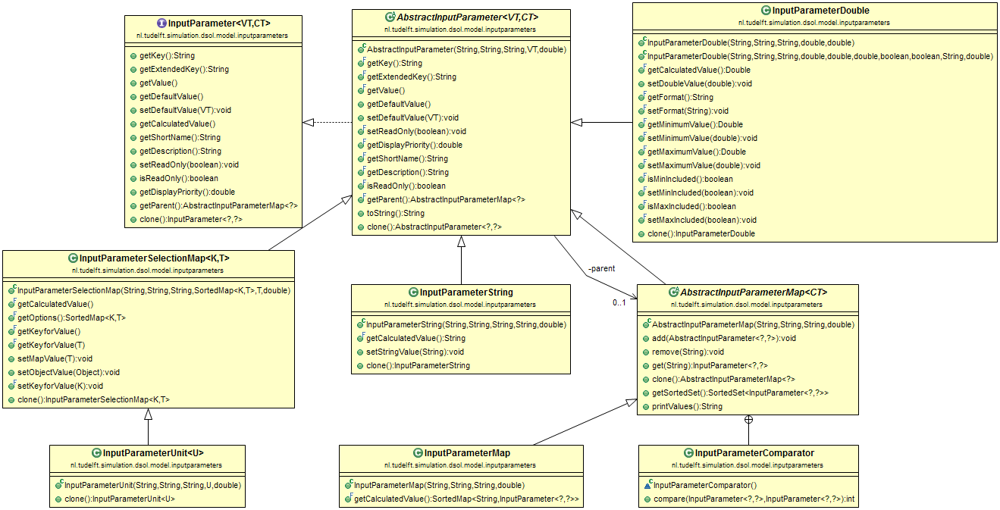
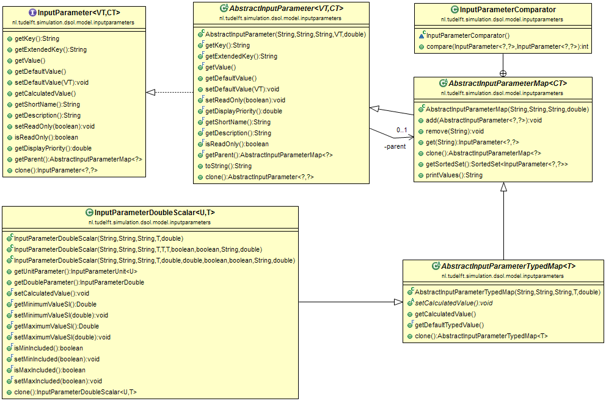

# Input Parameters

## InputParameterMap

Each DSOLModel contains an `InputParameterMap`. The idea of the `InputParameterMap` is to provide an easy way to specify known input parameters of the model. The `InputParameterMap` specifies the typed parameters using a tree structure. Each entry of the Map has a key and a value; the key is a String, and the value is an InputParameter, which can -- again -- be an `InputParameterMap`. Easy-to-use input parameters have been defined, such as the `InputParameterDouble` and the `InputParameterString`. Also more complex input parameters exist, such as the `InputParameterUnit`, the `InputParameterDoubleScalar`, and the `InputParameterDistContinuous`.

The InputParameters that a model needs to run are specified in the DSOLModel; usually in the contructor of the model class. The `AbstractDSOLModel` defines the following field:

```java
protected InputParameterMap inputParameterMap = 
    new InputParameterMap("model", "Model parameters", "Model parameters", 1.0);
```

In the constructor of the model, the input parameters can now be defined. An easy-access method `addInputParameter` is available:

```java
public void addInputParameter(final AbstractInputParameter<?, ?> inputParameter) throws InputParameterException
```

The methods can, e.g. be used as follows:

```java
InputParameterBoolean paramBool1 =
    new InputParameterBoolean("boolean1", "Boolean value 1", 
        "Boolean value 1 using tickbox", false, 1.0);
InputParameterDouble paramDouble = new InputParameterDouble("goodsTonPerYear", "Goods in tonnes/year",
        "Amount of goods in tonnes per year", 100000.0, 0.0, 1.0E12, true, true, "%f", 2.0);
List<String> countries = new ArrayList<>();
countries.add("USA");
countries.add("Netherlands");
countries.add("Germany");
countries.add("France");
countries.add("Belgium");
InputParameterSelectionList<String> paramCountry = 
    new InputParameterSelectionList<String>("country", "Country",
        "Country to select", countries, "Netherlands", 3.0);
addInputParameter(paramBool1);
addInputParameter(paramDouble);
addInputParameter(paramCountry);
```

This specifies the parameters that the model needs, including their default value. Somewhere, the parametres are set for the specific experiment. This can be done by defining an experiment with parameter values, by user input (specific methods exist in the dsol-swing and dsol-web projects to do so), or by reading from a file (several reader implementations are provided in dsol-core). When later in the model a value of a parameter is needed, it siffices to say, e.g.:

```java
if ((boolean) getInputParameter("boolean1"))
   doSomething();
double tonnes = (double) getInputparameter("goodsTonPerYear");
switch ((String) getInputparameter("country"))
{
    case "USA":
      xxx();
    case("Netherlands"):
      yyy();
}
```


## InputParameter relations

The diagram below specifies a few of the existing input parameter types:



The following can be noted from the diagram:
* The interface `InputParameter` specifies the basic behavior. Parameters have the following properties:
  - they are typed with a generic `<VT>` that specifies the type of the value stored in the parameter
  - they are typed with a generic `<CT>` that specifies the calculated type of the value, which is usually equal to the VT-type
  - they have a key of type `String`
  - they have a default value and a current value
  - they have a short name and a more extensive description
  - they can be read only
  - they have a double `displayPriority` that indicates the logiical order of display
  - they can have a parent, which is always an `InputParameterMap`
  - they can be cloned, e.g., to preserve the vlaues between replications
* The reference implementation `AbstractInputParameter` implements most of the standard methods. All implementations of InputParameters extends the `AbstractInputParameter`.
* Example implementations are:
  - `InputParameterString` to store a `String` value
  - `InputParameterDouble` to store a `Double` value. Analogously, types `InputParameterFloat`, `InputParameterInteger`, `InputParameterLong` and `InputParameterBoolean` exist. The `InputParameterDouble` has several extras, such as the ability to set a lower bound and upper bound for the values (inclusive or exclusive), and a display format.
  - `InputParameterMap` itself is also a parameter. It has a key and a value, which is in this case a `SortedSet` of `InputParameter` instances. The set is sorted using the `displayPriority` field that each `InputParameter` has.
  - `InputParameterSelectionMap` is a special map, where one of several keys is selected to return one value belonging to that key. An example is the name of a State (`String`) that is selected using the abbreviation of that State (also a `String`). In that case, the SelectionMap would be specified as `InputParameterSelectionMap<String, String>`. 


## InputParameterUnit

Another, very specific, example of an `InputParameterSelectionMap` is given in the bottom left of the Figure; the `InputParameterUnit`. This is a Unit from the [djunits](https://djunits.org) project, such as a `DurationUnit` or a `LengthUnit`. The `InputParameterUnit` automatically creates a map for all defined units for that unit type and maps them onto the right Unit instance. When we take the `DurationUnit` as an example, the mapping made is as follows:

|  Key  |  Unit  |
|  :-----          |  :-----          |
|  Second |  `DurationUnit.SECOND` |
|  Minute |  `DurationUnit.MINUTE` |
|  Hour |  `DurationUnit.HOUR` |
|  etc. |  etc. |


## InputParameterDoubleScalar

The `InputParameterDoubleScalar` is able to store a value from [djunits](https://djunits.org) such as a `Length` or a `Duration`:



The `InputParameterDoubleScalar` extends a so-called `AbstractInputParameterTypedMap` (see below), which can resurn a single typed value based on multiple input parameters. In this case, a double value and a unit need to be specified to make a DoubleScalar such as a `Duration` or a `Length`. For example, for an `InputParameterDoubleScalar<LengthUnit, Length>`, the user needs to specify **two values**; the numeric value (e.g., 20.0) and the unit (e.g., `LengthUnit.KILOMETER`) to specify a **single** Length. The `AbstractInputParameterTypedMap` is a special `InputParameterMap` where multiple input values, that each can be specified separately, are combined into one types input parameter for the model. The `getValue()` method returns the sub-map with the value and the type. In order to get the (e.g., Length) value, use the `getCalcuatedValue()` method. 


## InputParameterDistContinuous

The specification of an imput parameter for a continuous (or discrete) distribution function is a bit more complex than specifying a single parameter. First the distribution **function** has to be chosen, followed by the specification of the **parameters** for that specific distribution function. Programmatically, the `InputParameterDistContinuous` can be used for this purpose. It is a normal, single valued, parameter, where the value is a `DistContinuous`. Specification is, e.g., as follows:

```java
InputParameterDistContinuous ipDist = new InputParameterDistContinuous("arrDist", 
        "Arrival distribution", "Arrival distribution, e.g. DistExponential(lambda)", 
        stream, new DistExponential(stream, 1.0), 6.0);
this.inputParameterMap.add(ipDist);
```

When another value is allocated to this parameter, e.g. in the Treatment, the following code snippet servers as an example:

```java
InputParameterMap ipMap = getInputParameterMap();
InputParameterDistContinuous arrDist = (InputParameterDistContinuous) ipMap.get("arrDist");
arrDist.setDistValue(new DistExponential(arrDist.getStream(), 2.17));
```

The code for the Discrete distributions works analogously.


## InputParameterSelectionList

When a number of objects or values from a list have to be selected, the `InputParameterSelectionList` can be used. An example is shown below:

```java
List<String> countries = new ArrayList<>();
countries.add("USA");
countries.add("Netherlands");
countries.add("Germany");
countries.add("France");
countries.add("Belgium");
InputParameterSelectionList<String> paramSelect = 
    new InputParameterSelectionList<String>("country", "Country",
        "Country to select", countries, "Netherlands", 3.0);
this.inputParameterMap.add(paramSelect);
```


## Retrieving sub-parameters with dot notation

Suppose we have an `InputParameterMap` for the DSOLModel that contains a sub-map called "other". In the 'other' map, there is a length of type Length called "length". We want to know the si-value of the entered length. The code below goes down the tree step by step...

```java
InputParameterMap subMap =(InputParameterMap) this.inputParameterMap.get("other");
@SuppressWarnings("unchecked")
InputParameterDoubleScalar<LengthUnit, Length> ipds =
   (InputParameterDoubleScalar<LengthUnit, Length>) ipMap.get("length");
Length l = ipds.getCalculatedValue();
System.out.println(l);
```

Instead, we can use 'dot-notation' to traverse the tree:

```java
Length l = (Length) this.inputParameterMap.get("other.length").getCalculatedValue();
System.out.println(l);
```


## Types used to specify multiple values

|  Type  |  Explanation  |
|  :-----          |  :-----          |
|  `InputParameterMap` |  Map of String - InputParameter pairs where **each parameter** needs to get a value.<br>The InputParameterMap contains a number of InputParameters, each of which can also be an InputParameterMap again. The InputParameterMap provides functions to add and remove sub-parameters, to retrieve sub-parameters based on their key, and to return a sorted set of InputParameters based on their displayValue. |
|  `InputParameterSelectionList` |  List of objects where **one value** is chosen from the list. <br>The InputParameterSelectionList contains a list of values to select from. An example would be a list of countries (String), a list of states (String), or a list of logarithmic speeds for a simulation model (double). The InputParameterSelectionList extends AbstractInputParameter&lt;T, T&gt; and not AbstractInputParameter&lt;List&lt;T&gt;, List&lt;T&gt;&gt; because the value it can return is the item in the list and not the list itself. |
|  `InputParameterSelectionMap` |  Map of String - InputParameter where **one input parameter** is chosen from the map using the String as key.<br>The InputParameterSelectionMap contains a list of key values to select from, each leading to another value to be selected as the value. An example would be a list of human readable ISO-3166 2-letter country codes to choose from (String), whereas the ISO3166 numeric code would be stored as an int. The InputParameterSelectionMap extends AbstractInputParameter&lt;T, T&gt; and not AbstractInputParameter&lt;Map&lt;K,&nbsp;T&gt;, Map&lt;K,&nbsp;T&gt;&gt; because the value it can return is the value-item in the map and not the map itself  |
|  `AbstractInputParameterTypedMap` |  Map of String - InputParameter pairs where **one value** is chosen from the map; the value is a different one than the key-value pairs.<br>The InputParameterTypedMap is a hierarchical input parameter that can return a variable of a certain type. An example is a scalar where a double value and a unit have to be inputed. The InputParameterTypedMap is then supposed to be able to return the scalar based on the two sub-values. The same holds, e.g., for a continuous distribution function. The input parameter for a continuous distribution should be able to return the chosen distribution, but internally it consists of a selection list or selection map for the distribution, followed by one or more parameters for the chosen distribution, which are stored in an InputParameterMap. The `getCalculatedValue()` method is used to return the value that has been calculated based on the information in the sub-map. |


## InputParameters for entering distributions

The input parameters for entering distributions by a user can be found under the [Advanced Topics](../../advanced/input-parameters-for-distributions).
