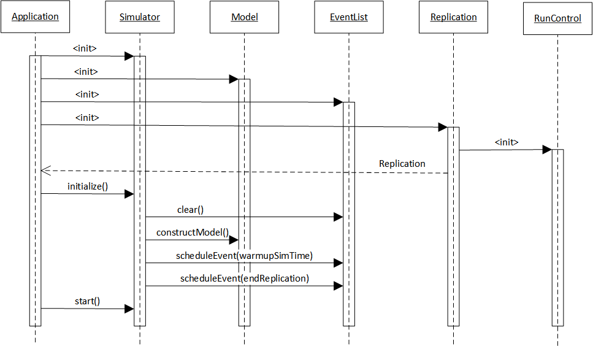
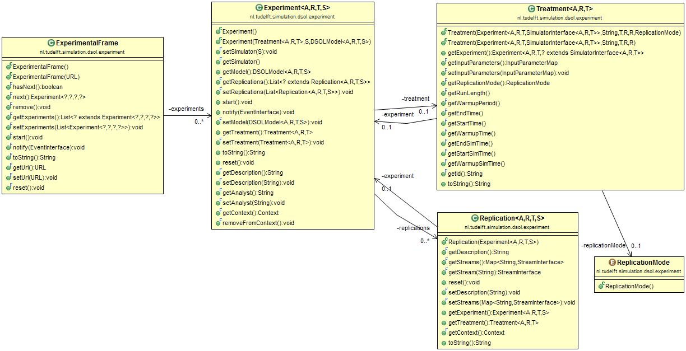

# Model Structure

## Model - Simulator - Experiment

In line with the Framework of Modeling &amp; Simulation (Zeigler et al., 2000, p.26) as depicted in the Figure below, a Simulation consists of the following elements:
* A **Model** that contains the logic to execute the required state changes over time. In DSOL, the Model is represented by the `Model` interface and `AbstractModel` reference implementation.
* A **Simulator** that can execute the model and advance time. In DSOL, the Simulator has many implementation for different simulation formalisms, such as the `DEVSSimulator` for discrete-event models, the `DESSSimulator` for continuous models, the `DEVSRealTimeAnimaor` for real-time models, and the `DEVDESSSimulator` for mixed DEV&amp;DESS models. 
* An **Experimental Frame** that describes the conditions under which the system is observed or esperimented with. The Experimental Frame is implemented in DSOL using the `Experiment`, `RunControl` and `Replication` classes. 


<center><font size="2"><i>Basic Entities in Modeling and Simulation and their Relationships (Zeigler et al., 2000, p.26)</i></font></center>

Typically, the above three elements are created for any simulation to run:

```java
public MM1Application() throws SimRuntimeException, RemoteException, NamingException
{
    DEVSSimulator<Double> simulator = new DEVSSimulator<>("mm1");
    MM1Model model = new MM1Model(simulator);
    ReplicationInterface<Double> replication = 
        new SingleReplication<>("rep1", 0.0, 0.0, 100.0);
    simulator.initialize(model, replication);
    simulator.start();
}
```

In words, the above code does the following:

1. Make an instance of a simulator with double floating point variables as the simulation time
2. Make an instance of a model with the same time units
3. Make an instance of a replication for the model that runs from time 0.0 till 100.0 without warm-up time
4. Have the simulator build and initialize the model for the given replication
5. Start the simulator, which will execute all events between times 0.0 and 100.0

In step 3 above, implicitly an `RunControl` object is also generated. Behind the scenes, the following code is executed in the `new SingleReplication<>(...)` method call:

```java
    public SingleReplication(final String id, final T startTime, 
        final T warmupPeriod, final T runLength)
    {
        this(new RunControl<T>(id, startTime, warmupPeriod, runLength));
    }
}
```

In this case, no `Experiment` is created. The `Experiment` class can take care of executing multiple replications, each with their own seed for the random number generator. The replications inside an experiment are of type `ExperimentReplication` with a corresponding `ExperimentRunControl`.

The above steps are illustrated by the following sequence diagram:




## The DSOL model

The `DSOLModel` interface forces the following methods to be in place:

```java
public interface DSOLModel<T extends Number & Comparable<T>, S extends SimulatorInterface<T>>
{
    /**
     * construct a model on a simulator.
     * @throws SimRuntimeException on model construction failure
     */
    void constructModel() throws SimRuntimeException;

    /**
     * Return the simulator for this model.
     * @return the simulator for the model
     */
    S getSimulator();

    /**
     * Get the input parameters for this model.
     * @return List&lt;InputParameter&gt; the input parameters for this model
     */
    InputParameterMap getInputParameterMap();

    /**
     * Get the output statistics for this model.
     * @return List&lt;StatisticsInterface&gt; the output statistics for this model
     */
    List<StatisticsInterface<T>> getOutputStatistics();

    /**
     * Set the initial streams of the model based on a StreamInformation object.
     * @param streamInformation StreamInformation; the random streams to use
     */
    void setStreamInformation(StreamInformation streamInformation);

    /**
     * Return the available streams of the model stored in a StreamInformation object.
     * @return streamInformation StreamInformation; the random streams used by the model
     */
    StreamInformation getStreamInformation();
}
```

* The `constructModel()` method that is called whenever a `Replication` is initialized. In essence, the `constructModel()` method does exactly what the name suggests: it builds a new, blank version of the model. When multiple replications are carried out with a model, we have to be able to ensure that the model is blank when initialized (at least when the replication mode is equal to `ReplicationMode.TERMINATING`; see below under replication modes for more explanation). When expensive calculations have to be made to construct the model, these can of course be cached. The constructore of the model class can take care of the one-off initializations that will speed up the model construction.
* The `getSimulator()` method that can tell on which simulator the model runs. In the code, simulation time can be requested by `getSimulator().getSimulatorTime()` to retrieve the time. Depending on the simulator, events can be scheduled on the event list, or other time-state related activities can be carried out. The `AbstractDSOLModel` class makes a reference implementation of the `getSimulator()` method, so when extending the model from `AbstractDSOLModel`, this method is already implemented.
* The `getInputParameterMap()` method that is able to retrieve the input parameters for which the model runs. Typically, the `Treatment` for the `Experiment` specifies which input parameters are used for the execution of each of the replications in the experiment. Input parameters are those things that the modeler wants to be able to set to carry out `what-if` experiments with the model.
* The `getOutputStatistics()` method that is able to report the output statistics that the model can calculate. This can be important for setting up a flexible user interface, where output statistics are shown to the user, or for exporting the output statistics at the end of a run to a file or database. 
* The `setStreamInformation(...)` and `getStreamInformation()` methods are used for providing the simulation with the correct random number generators (RNGs) and the appropriate seeds for the simulation to run.


## Experiment - Replication - RunControl

The three classes `Experiment`, `Replication`, and `RunControl` take care of specifying exactly under what conditions an experiment of a model is carried out. Each of these classes has a number of unique features. These are explained below.

!!! Warning
    The below information still needs to be updated with the changes in DSOL 4.0 and DSOL 4.1.

### Replication

The `Replication` object specifies under what stochastic conditions the model logic is executed. It is responsible for a one-time execution of the model. The most important properties to set for the Replication are the random streams. Each replication is expected to differ from the other replications only by the random number generation. Input and output specifications should be the same. The method for setting a unique set of random streams is the `setStreams(...)` method:

```java
/**
 * sets the stream for this replication.
 * @param streams Map&lt;String,StreamInterface&gt;; the map of stream,name tuples
 */
public final void setStreams(final Map<String, StreamInterface> streams)
{
    this.streams = streams;
}
```

Each random stream is uniquely identified by a String id. The `getStream()` method is then able to return a specific stream from the Map:

```java
/**
 * returns a specific stream.
 * @param name String; the name of the stream
 * @return StreamInterface the stream
 */
public final StreamInterface getStream(final String name)
{
    return this.streams.get(name);
}
```

In the model, the replication of the current execution can be requested via the Simulator. So retrieving a random stream with the name _default_ from the replication is done from the model as follows:

```java
StreamInterface stream = getSimulator().getReplication().getStream("default");
```


### Treatment

The `Treatment` object specifies the run control conditions: at what time does the model start, how long should it run, is there a warm-up period or not, and if yes, how long is it? The units in which these times are specified are given by the simulation time unit that the model and the simulator use.

In addition, the `Treatment` specifies the input parameters for the model. As there is one treatment per experiment, the model parameters for all replications in one experiment are the same (with the exception of the seeds of the randon number generators). In the default implementation of the `AbstractDSOLModel`, the InputParameterMap is stored in the Model and can be retrieved with a default method in the Treatment to set the values of the parameters for that particular Experiment. 


### Experiment

The `Experiment` class links the Model, the Simulator, the Treatment, and the Replications. In other words, it specifies one set of input parameter values and run control conditions with which the model has to be executed a number of times (as indicated by the list of replications) on the simulator. 


### ExperimentalFrame

An `ExperimentalFrame` is nothing more than a list of Eperiments. When many experiments, each with a number of replications, have to be carried out, they can be bundled into an ExperimentalFrame. When the `start()` method is called on the ExperimentalFrame, all replications of all experiments are carried out one-by-one. 


## Relations between Experiment classes

The relation between the different Experiment classes is shown in the UML diagram below. All public methods of the classes are shown.



It is clear from the diagram that:
* An `ExperimentalFrame` has zero or more instances of `Experiment`
* An `Experiment` has a `Treatment`, and a `Treatment` belongs uniquely to an `Experiment`
* An `Experiment` has zero or more instances of `Replication`, and a `Replication` belongs uniquely to an `Experiment`
* A `Treatment` has a `ReplicationMode` 

!!! Info
    The `DSOLModel` knows what input parameters it has.<br>
    
!!! Info
    The `Treatment` or `Experiment` can set the values for the input parameters <br>
    
!!! Info
    The `Replication` sets the seed values for the Random Number Generators.

Before an execution of a model can start, an Experiment, Treatment, and Replication has to exist. The combination of these three objects is necessary to specify how the simulation model should be executed. The easiest way to make these classes is by the `Replication.create(...)` static helper method. For a simulation model that uses `TimeDoubleUnit` as the time, the replication can for instance be created as follows:

```java
Replication replication = Replication.TimeDoubleUnit.create("rep1", 
    Time.ZERO, Duration.Zero, new Duration(100.0, DurationUnit.MINUTE), model);
```

which means that the model will be executed for a single replication by the simulator from time zero, without warmup time, for 100 minutes.

