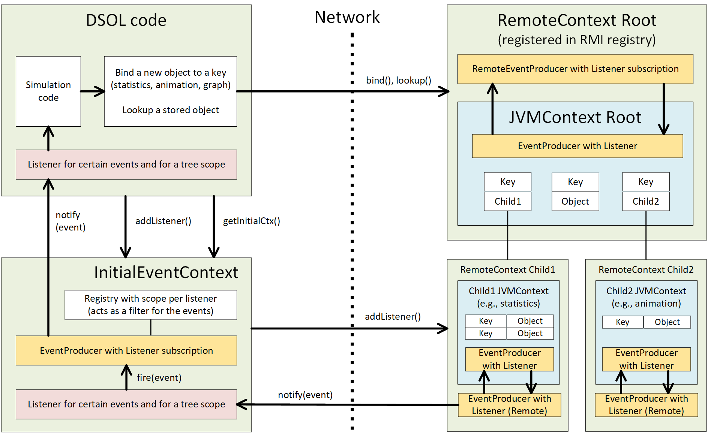
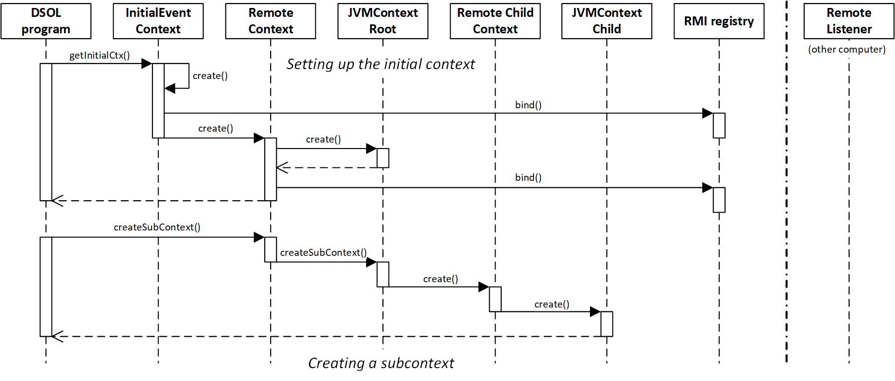

# The Naming Context

DSOL stands for **Distributed** Simulation Object Library. DSOL has been set-up with distribution in mind. Distribution of models, distribution of model components, and the ability to get access to the state of the model, the model's animation, and the results from experiments from other computers than the computer(s) where the model is running. This means that we need sound communication between diferent computers on a network. 

When objects want to communicate with each other within a program or over a network, different solutions exist. Objects can communicate through sockets using serialized content (as an example, see [djutils-serialization](https://djutils.org/manual/djutils-serialization) and the [sim0mq project](https://sim0mq.org/manual/)). Java offers RMI (Remote Method Invocation) in addition to communicating content over the network. RMI allows to call methods on objects that are present in another JVM on another computer. Of course RMI can also find objects in another JVM on the same computer, or in the same JVM. Objects are bound to a **registry** within RMI, where they can be found using a key.

The RMI registry is a flat system, however, where all objects reside at the same level and key clashes can occur easily. In addition to RMI, Java has a system called JNDI (Java Naming and Directory Interface), which provides a hierarchical registry that looks like a directory structure. JNDI is ideal for creating the hierarchical structure that we would need for storing simulation results and simulation model state, and providing access to the results to other programs over the network. DSOL has a _lightweight_ implementaton of JNDI, where the directories in which references are stored a `Context`. Contexts can contain other Contexts, forming a tree structure with content that can be retrieved using a structure similar to an URL / URI or a directory structure: /level1/level2/key where level1 and level2 are sub-contexts and key is the key that is bound to an object of interest.

## Use of Contexts in DSOL

In DSOL, different structures are stored in a context:

* **2D Animation objects**, which enables viewing 2D animation from clients on other computers.
* **3D Animation objects**, which enables viewing 3D animation from clients on other computers.
* **Statistical objects**, such as the `SimTally`, `SimCounter` and `SimPersistent`, which enables viewing of statistical results during the simumation run and at the end of a simulation run on other computers.
* **Output Plots**, such as the `Histogram`, `BoxAndWhiskerPlot`, and the `XYPlot`, which enables viewing of graphs during the simumation run and at the end of a simulation run on other computers.

When a model is built, typically several Experiments are carried out with the model, and each experiment has several Replications. Therefore the structure of the Context directory tree is as follows:

<pre>
root +-- experiment1 +-- replication1 +-- animation +--- D2 --- 2D animation objects
     |               |                |             +--- D3 --- 3D animation objects
     |               |                |
     |               |                +--------- statistics --- statistics objects
     |               |                +----------charts ------- chart objects
     |               |
     |               +-- replication2 +-- animation +--- D2 --- 2D animation objects
     |               |                |             +--- D3 --- 3D animation objects
     |               |                |
     |               |                +--------- statistics --- statistics objects
     |               |                +----------charts ------- chart objects
     |               |
     |               +-- etc.
     |               |
     |               +-- statistics ----- objects that capture averages over the replications
     |
     +-- experiment2 +-- replication1 +-- animation +--- D2 --- 2D animation objects
     |               |                |             +--- D3 --- 3D animation objects
     |               |                |
     |               |                +--------- statistics --- statistics objects
     |               |                +----------charts ------- chart objects
     |               +-- etc.
     +-- etc.
</pre>

The advantage of this structure is that experiments can easily be compared (side-to-side), and that results from multiple replications can be retrieved. Statistical results are stored per replication, but also averaged over replications to provide averages and confidence intervals for the performance indicators per experiment.

## Types of Contexts

DSOL implements four different types of lightweight `Context` implementations (the interface that defines the contract of a `Context` is the `ContextInterface`):
1. The **`JVMContext`**. This context stores all information in memory. The context cannot be reached over the network. It can be _wrapped_ in a `RemoteContext`, however, making the results available to other computers via the `RemoteContext`.
2. The **`FileContext`**. This is a `JVMContext` that also serializaes all content to a file on disk. This makes a `FileContext` a _persistent_ context that will still contain the anmation objects, statistics, graphs after the program has ended (planned or after an error). The `FileContext` can also be wrapped in a `RemoteContext`.
3. The **`RemoteContext`**. This is a context that is registered as one RMI object in the RMI registry, and is therefore accessible by other programs on the network. A `RemoteContext` always wraps another Context to carry out the work.

The **`InitialEventContext`** is not a Context itself, but it **contains a pointer to** one of the above Contexts, and it provides detailed information about changes that occur to the objects in the Context and in the Context's structure. All Contexts are an `EventProducer`, but the `InitialEventContext` can give information to subscribers about certain parts of the tree: a _Node_, a _Level_, or a _Subtree_. Thereby a `Listener` that is only interested in updates of graphs will not also receive a multitude of animation events over the network. In a DSOL program, there is typically one Singleton InitialEventContext that contains information about the experiments and animation, but in theory, there could be more than one. 

## Interaction with a Context

The picture below shows how an `InitialEventContext` is set-up locally within a JVM, where the `InitialEventContext` points to a `JVMContext` that contains the content. The top part of the diagram shows how the initial context is et-up. The second part shows how a subcontext is created. Below that, the DSOL program, which implements the `EventListenerInterface` subscribes itself to the events within a certain tree in the `JVMContext` by calling the `addContextListener(key, Scope)` method in the `InitialEventContext`. The `InitialEventContext` delegates the actual firing of events to the `JVMContext` object(s) that are part of the scope of the indicated scope when adding the ContextListener. When the DSOL program adds an object to the `JVMContext`, listeners are automatically notified of the change through the `notify(Event)` method (bottom part of the diagram). 

Types of events that can be communicated to a listener are:
* `OBJECT_ADDED_EVENT` is fired when an object is added to the Context, to those listeners that have a subscription including this Context. The payload is an `Object[]` containing the context in which the object has been bound, the relative key in the context, and the bound object.
* `OBJECT_REMOVED_EVENT` is fired when an object is removed from the Context, to those listeners that have a subscription including this Context. The payload is an `Object[]` containing the context in which the object was bound, the relative key in the context, and the removed object.
* `OBJECT_CHANGED_EVENT` is fired when an object's content changes, to those listeners that have a subscription including the Context in which the object is bound. The payload is an `Object[]` containing the context in which the object is bound, the relative key in the context, and the object after the change.

## Interaction with a RemoteContext

Interacting with a `RemoteContext` is somewhat more complex than interacting with a `JVMContext` as shown above. The picture below shows schematically how a piece of DSOL code, the `InitialEventContext`, a `RemoteContext`, and an embedded `JVMContext` link together and interact. 

Code can interact directly with the nodes in the Context tree, as is shown with the top arrow in the middle. Adding subcriptions for changes in a certain part of the tree (one Context object) can also be done directly. In such a case, one of the objects in the DSOL program adds itsef as an `EventListener` to one Context in the `JVMContext`, `FileContext` or `RemoteContext` directly. The `InitialEventContext` is useful if we want to get subscriptions to multiple nodes. We subscribe in such a case to the events at the `InitialEventContext`, which will take care that we receive updates of, e.g., an entire subtree of the Context. 

The above picture is an extreme example. Typically, we will take care that the `RemoteContext` is on the **same** computer as the DSOL program and the `InitialEventContext`. A `RemoteListener` subscribes to updates of the `RemoteContext` that acts as a `RemoteEventProducer`. The embedded `JVMContext` or `FileContext` acts as a normal `EventProducer` and fires its events to the `RemoveEventProducer` that retransmits the event to its `RemoteListeners`. When `RemoteListeners` want to subscribe to a certain scope of the Context tree, a `RemoteInitialEventContext` needs to be set up that registers itself in the RMI registry and can later be found by a `RemoteEventListener`. The way this works is shown conceptually in the following sequence diagram, where the DSOL program sets up a (Remote) `InitialEventContext` that registers itself in the RMI Registry. It creates a `RemoteContext` and an embedded `JVMContext`, where the `RemoteContext` also registers itself in the RMI Registry. The bottom part of the diagram shows that the DSOL program asks the `RemoteContext` to create a child context. The request for this is delegated to the embedded `JVMContext` (the `RemoteContext` acts as an empty shell that delegates most methods, except for the registration of RemoteEventListeners and firing of events to these listeners):

Each of the JVMContexts is "wrapped" inside a RemoteContext. This is necessary, because 

