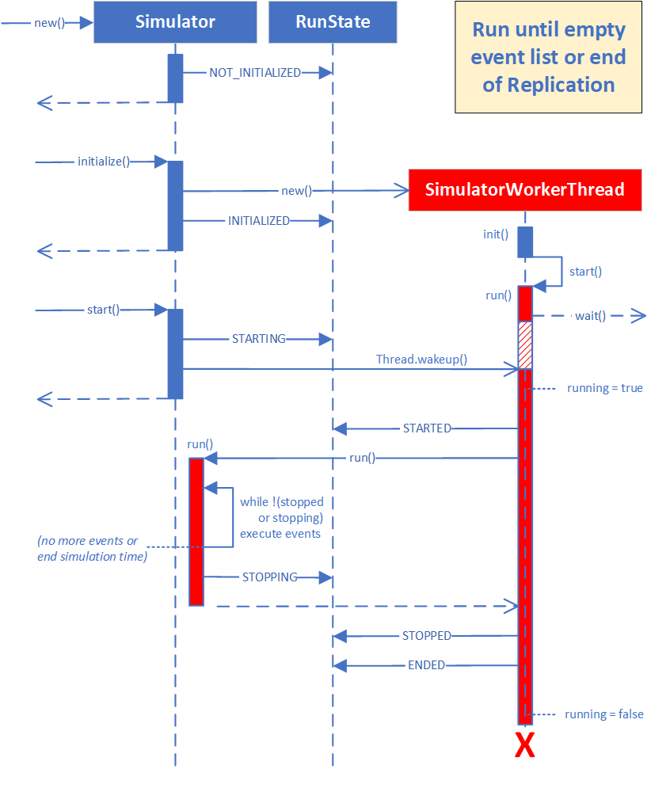
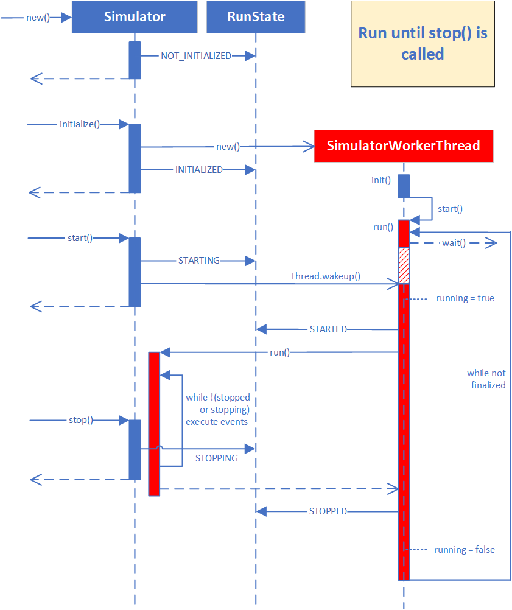

# Simulator State

The `Simulator` in DSOL is a multi-threaded state machine. It contains a `RunState` that indicates the state that the model execution is in. This is important, since the multi-threaded character of the application means that changes are not instantaneous. As an example, when the simulator is told to stop with a `stop()` method call, and the current event being executed takes long to complete, the `Simulator` won't stop until the event execution has completed. We have a special state for that indicating that the Simulator is `STOPPING`. After the event completion, the `Simulator` is `STOPPED`. Depending on the state of the `Simulator` certain actions are or are not allowed. 

Similarly, the execution of a `Replication` can be in different states. For instance, a replication can be `STARTING`, meaning that the model is being constructed and the data structures for the model are being set-up, but this is different from `STARTED` where model code has actually executed. Again, the state machine for the `ReplicationState` allows certain actions to take place, and forbids other  actions. The `RunState` and the `ReplicationState` are obviously related to each other.

## RunState

RunState has the following possible values: `NOT_INITIALIZED`, `INITIALIZED`, `STARTING`, `STARTED`, `STOPPING`, `STOPPED`, `ENDED`.

The `RunState` is the communication between the main thread or user interface (UI) thread and the `SimulatorWorkerThread`. Initial states `NOT_INITIALIZED`, and `INITIALIZED` shall be set only by the main / UI thread. `NOT_INITIALIZED` is set in the constructor and the cleanup() method; `INITIALIZED` Is set by the `initialize(...)` method, and indicates that the simulator can be started.

`STARTING` and `STOPPING` shall be set only by the main thread / UI thread, and indicate the intent to start or stop the simulator. Actual starting or stopping can take a while after the RunState has been set, because the simulation itself is executed by another thread: the `SimulatorWorkerThread`.

`STARTING`: After starting has been set, an interrupt is sent to the `SimulatorWorkerThread` to wake it up from its `Thread wait()` state. The `SimulatorWorkerThread.run()` method fires a `START_EVENT` to listeners (e.g., the GUI), and sets the RunState to `STARTED`, just before the Simulator's `run()` method is called. It can take some time to wake up -- so there is an unspecified time between the `RunState.STARTING` and `RunState.STARTED` states. As long as the `Simulator.run()` is not finished (either because of calling `stop()`, an error In the simulation, an empty event list, or reaching the replication's run length), it will stay in a loop executing events in the `SimulatorWorkerThread`.

`STOPPING`: Between the execution of events, the Simulator's `run()` method (executed by the `SimulatorWorkerThread`) checks the `RunState`. When it Is found to be `STOPPING`, the Simulator's run() method ends, and the thread continues the execution of the SimulatorWorkerThread's `run()` method. Here, it will first set the `RunState` to `STOPPED`. Then, it will check whether the replication has to end (see `ReplicationState`). If so, it will set the `ReplicationState` to `ENDED`, and the RunState to `ENDED` as well. It will also fire an `END_REPLICATION_EVENT`.

`STOPPED`: After a `Simulator` has been stopped, it can be started again -- unless the end of the replication has been reached. Stopping the `Simulator` actually pauses the `SimulatorWorkerThread`, rather than terminating it.

The `RunState` acts as a state machine that guards the correct sequence of states for the simulation run. When an action is attempted that does not fit the state machine's logic, such as starting an already started simulator, or starting or stopping a simulation that has completely ended, an error can be raised.

!!! Note
    Note that the `endReplication()` method is not needed. The Simulator's `run()` method should take care of flagging whether the replication has ended -- and act accordingly. The `warmup()` event, on the other hand, is needed. By making the `SimulatorWorkerThread` responsible for the handling of the end of the replication, this does not have to be separately implemented in different Simulator implementations. Any object interested in the end of the replication (e.g., to collect statistics), should listen to the `END_REPLICATION_EVENT`.

## ReplicationState

`ReplicationState` has the following possible values: `NOT_INITIALIZED`, `INITIALIZED`, `STARTING`, `STARTED`, `ENDING`, `ENDED`.

The `ReplicationState` is used to keep track of the events that have or have not been sent for the replication. As an example, when `Simulator.start()` is called, and the simulator time is zero, one does not know whether the `START_REPLICATION_EVENT` still needs to be fired. When the simulation has multiple events at t=0, and it has executed `step()`, followed by `start()`, `START_REPLICATION_EVENT` has already been fired by the `step()` method. Without the `ReplicationState`, the `Simulator` has no way of knowing that the replication has already been started before. The `ReplicationState` helps by providing a clear sequence of states for a normal simulation run.

Initial states `NOT_INITIALIZED`, and `INITIALIZED` shall be set only by the main / UI thread. `NOT_INITIALIZED` is set in the constructor and the `cleanup()` method; `INITIALIZED` Is set by the `initialize(...)` method, and indicates that the replication can be started.

The `ReplicationState.STARTED` state is set in the `startImpl()` or the `step()` method after checking that the `ReplicationState` is `INITIALIZED`. This is important, since also the `START_REPLICATION_EVENT` is fired in `startImpl()` or `step()` when `ReplicationState` is `INITIALIZED`, ensuring that the `START_REPLICATION_EVENT` is only fired once.

The `ENDING` state should be set by the Simulator's `run()` method based on the state of the simulation and the event list. When the event list is empty or the simulator has reached the replication's run time, the `ReplicationState` can be set to `ENDING`. When the `run()` is interrupted by a `stop()` or when an error occurred, the `ReplicationState` can be left in the `STARTED` state.

A setting of `ENDING` for the `ReplicationState` is (and should) always be mirrored by a `STOPPING` state for the `RunState`. When the `Simulator.run()` method ends with `RunState.STOPPING` and `ReplicationState.ENDING`, the `SimulatorWorkerThread` will take care of firing an `END_REPLICATION_EVENT` and setting both the `ReplicationState` and the `RunState` to `ENDED`.

## Errors during simulation event execution

The following strategies exist when the execution of an event leads to an exception:

* **log and continue**: Send the error to the logger as WARNING. Both `RunState` and `ReplicationState` 
remain in the `RUNNING` state. The `Simulator.run()` continues as if the error did not occur.
* **warn and continue**: Send the error to logger as ERROR and print the exception on stderr.
Both `RunState` and `ReplicationState` remain in the `RUNNING` state. The `Simulator.run()`
continues as if the error did not occur.
* **warn and pause**: Send the error to logger as ERROR and print the exception on stderr The 
`RunState` goes to `STOPPING`, leading to the stop of the loop in the `Simulator.run()` method and a 
subsequent STOPPED state in the `SimulatorWorkerThread.run()` method. The `SimulatorWorkerThread` will 
go into a `Thread.wait()`, to wait for start (or cleanup).
* **warn and end**: Send the error to logger as SEVERE and print the exception on stderr The 
`Simulator.cleanup()` method is called to ensure the `SimulatorWorkerThread.run()` method completely 
ends and can be garbage collected. If there is a UI thread, it will keep running.
* **warn and exit**: Send the error to logger as SEVERE and print the exception on stderr The 
`Simulator.cleanup()` method is called to ensure the stop of the `run()` in `SimulatorWorkerThread`; the 
`System.exit()` method is called to end the complete program.

In order to set the error handling, the setPauseOnError() and isPauseOnError() methods are 
deprecated and replaced by new setErrorStrategy(ErrorStrategy strategy) and getErrorStrategy() 
methods. ErrorStrategy is an enum. The log level can be overridden (and even be set to NONE).

## Use of the worker thread -- complete run till end of replication

At `initialize()`, a `SimulatorWorkerThread` is instantiated. It starts its `run()` method, where it will 
issue a `Thread.wait()`, waiting for an interrupt. When the `start()` method on the regular (UI / main, 
in blue in the Figure below) thread is called, the interrupt is sent and the `SimulatorWorkerThread` 
starts the `run()` method of the simulator (in red in the Figure below).

This Figure shows a situation where the simulation run continues till the end of the simulation time 
is reached or where the event list gets empty.

## Use of the worker thread -- partial run till stop() is called

Calling `stop()` from the main or GUI thhred causes the simulation run to stop. This does not happen 
immediately, as the main/GUI thread and the `SimulatorWorkerThread` run in parallel. In this case, 
the `stop()` method sets the `RunState` to `STOPPING`, as can be seen in the Figure below.

After finishing the Simulator's `run()` method, the `SimulatorWorkerThread`'s `run()` method gets into a 
`wait()` state again, waiting for a next `start()` [or cleanup()] call.

## Concurrency problem of the use of the worker thread

The problem is that after calling `stop()`, `start()` can be called by the GUI or main thread before 
the `SimulatorWorkerThread` is in the `wait()` state, as illustrated below in black.

The `STARTING` state is overruled by the STOPPED state of the other thread, and the `Thread.wakeup()` 
call is done too early. Similar concurrency problems can uccur by calling `start()` before 
`initialize()` has finished. Calling `stop()` before the `start()` has completed can cause the `STOPPING`
state to be set before the `STARTED` state is set by the other thread.

## Solution

The problem is caused by the main/GUI thread exiting its methods before the right state has been 
reached. So these methods have to pause before exiting till the state of the `SimulatorWorkerThread` 
Is correct. It is not sufficient to set a boolean (like 'running') in the `SimulatorWorkerThread`, 
because the 'if not running' test can happen between setting `running = false` and the `wait()` 
operation...

The `initialize()` and `stop()` methods wait till the `SimulatorWorkerThread` is waiting or terminated 
(in the case of a very short simulation run). The `start()` method works with a runflag semaphore 
that indicates that the `run()` method has started (and could still be running or might have finished 
when we check). `start()` then clears the runflag. This should prevent too early calls as well as 
deadlocks.

## Implementation in Python

The waiting behavior of the `SimulatorWorkerThread` is implemented as an Event called
`wakeup_flag` in Python:

* `wakeup_flag.wait()` for waiting
* `wakeup_flag.set()` for waking up
* `bool _finalized` to determine if run is over
* `bool method is_waiting()` to determine if the `run()` method is in the `wait()` state implemented by 
`len(self.wakeup_flag._cond._waiters) > 0`
* if necessary, we can also check for self.is_alive() state to see if the `run()` method -- and 
thereby the whole thread -- has terminated or not

## Implementation in Java

The waiting behavior of the `SimulatorWorkerThread` is implemented as an ordinary `wait()` in the `run()` 
method of the `SimulatorWorkerThread`:

* `wait()` for waiting
* `notify()` for waking up
* `boolean _finalized` to determine if run is over
* `boolean is_waiting()` method to determine if the `run()` method is in the `wait()` state implemented 
by  `getState().equals(ThreadState.WAITING)`
* if necessary, we can also check for `getState().equals(ThreadState.TERMINATED)` to see
if the `run()` method -- and thereby the whole thread -- has terminated or not

